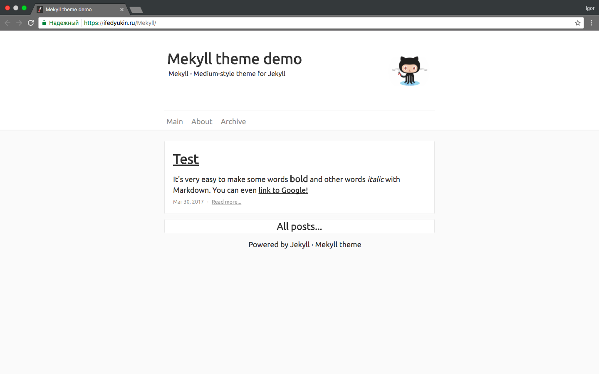

This is a Medium style Jekyll theme for anyone who want to create their website or Blog that look like Medium - a platform for people to read, write and share stories that matter. 

# Mekyll (Beta version)
Medium style Jekyll theme.     
[Demo...](https://ifedyukin.github.io/Mekyll)    
---

We are still developing this style theme. 
If you want to get involved, simply:

* Fork the project and create a new branch;
* Create an issue (optional);
* Raise a 'Pull Request' citing the issue (if any) with that branch to merge into this master branch!   

You can offer any improvement to the theme - [Issue #3](https://github.com/ifedyukin/Mekyll/issues/3).
